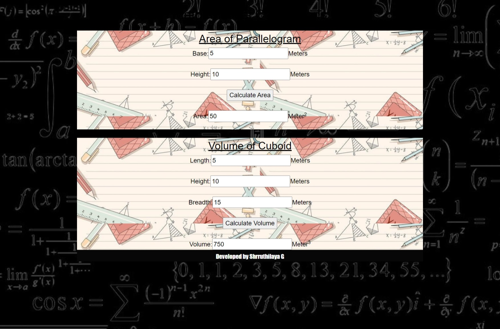

# AngularCalculation

# Web Page for Mathematical Calculations using Angular

## AIM:
To design a dynamic website to perform mathematical calculations using Angular Framwork

## DESIGN STEPS:

### Step 1:

Requirement collection.

### Step 2:

Creating the layout using HTML and CSS in component.html file

### Step 3:

Write typescript to perform the calculations.

### Step 4:

Validate the layout in various browsers.

### Step 5:

Validate the HTML code.

### Step 6:

Publish the website in the given URL.

## PROGRAM :
### app.component.html:
~~~

<body>
    

    <h1>Mathematical Calculations</h1>
    

        <h2><u>Area of Parallelogram</u></h2>
        <Parallelogram-Area class="formelement"></Parallelogram-Area>
    

    

        <h2><u>Volume of Cuboid</u></h2>
        <Cuboid-Volume class="formelement"></Cuboid-Volume>
    

    

        Developed by Shrruthilaya G
   

    

</body>
~~~

### app.module.ts:
~~~
import { NgModule } from '@angular/core';
import { BrowserModule } from '@angular/platform-browser';

import { AppComponent } from './app.component';
import { NgbModule } from '@ng-bootstrap/ng-bootstrap';
import { StudentComponent } from './student/student.component';
import { FormsModule } from '@angular/forms';
import { CuboidComponent } from './student/cuboid.component';
import { ParallelogramComponent } from './student/parallel.component';

@NgModule({
  declarations: [
    AppComponent,StudentComponent,CuboidComponent,ParallelogramComponent
  ],
  imports: [
    BrowserModule,
    NgbModule,
    FormsModule
  ],
  providers: [],
  bootstrap: [AppComponent]
})
export class AppModule { }
~~~

### cuboid.component.html:
~~~

    Length:<input type="text" [(ngModel)]="clength">Meters 
     
    Height:<input type="text" [(ngModel)]="cheight">Meters 
     
    Breadth:<input type="text" [(ngModel)]="cbreadth">Meters 
     
    <input type = "button" (click)="onCalculateVolume()" value="Calculate Volume"> 
     
    Volume:<input type="text" readonly value="0" [value]="volume">Meter3

~~~

### cuboid.component.ts:
~~~
import { Component } from "@angular/core";

@Component({
    selector:'Cuboid-Volume',
    templateUrl:'./cuboid.component.html'
})

export class CuboidComponent{
    clength:number;
    cbreadth:number;
    cheight:number;
    volume:number;
    constructor(){
        this.clength = 0;
        this.cbreadth = 0;
        this.cheight = 0;
        this.volume = this.clength*this.cbreadth*this.cheight;
    }
    onCalculateVolume()
    {
        this.volume = this.clength*this.cbreadth*this.cheight;
    }
}
~~~

### parallel.component.html:
~~~

    Base:<input type="text" [(ngModel)]="breadth">Meters 
     
    Height:<input type="text" [(ngModel)]="height">Meters 
     
    <input type = "button" (click)="onCalculatearea()" value="Calculate Area"> 
     
    Area:<input type="text" readonly value="0" [value]="area">Meter2

~~~

### parallel.component.ts:
~~~
import { Component } from "@angular/core";

@Component({
    selector:'Parallelogram-Area',
    templateUrl:'./parallel.component.html'
})

export class ParallelogramComponent{
    breadth:number;
    height:number;
    area:number;
    constructor(){
        this.breadth = 0;
        this.height = 0;
        this.area = 0;
    }
    onCalculatearea(){
        this.area=this.breadth*this.height
    }
}
~~~

### index.html:
~~~
<!doctype html>
<html lang="en">
<head>
  <meta charset="utf-8">
  <title>Mathcalculations</title>
  <base href="/">
  <meta name="viewport" content="width=device-width, initial-scale=1">
  <link rel="icon" type="image/x-icon" href="favicon.ico">
</head>
<body>
  <app-root></app-root>
</body>
</html>
~~~

## OUTPUT:
### Blank page:

### Calculated page:

## Result:
Thus, A dynamic website to perform mathematical calculations is designed using Angular Framwork.